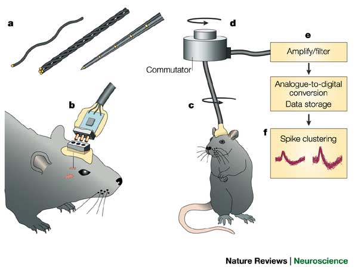
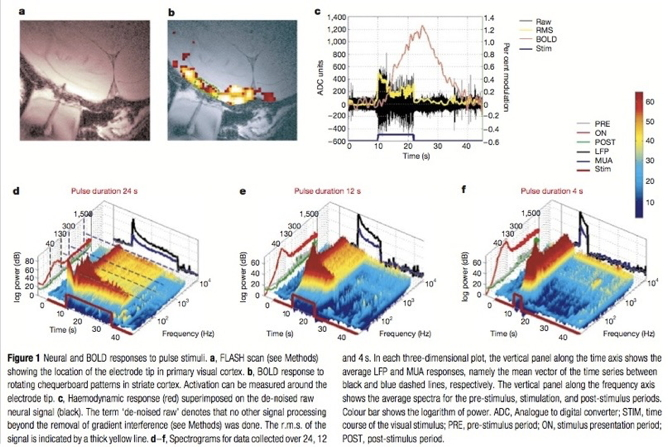

```{r set-up, echo=FALSE, error=FALSE, include=FALSE, warning=FALSE, message=FALSE}
path2figs = 'img'
knitr::opts_chunk$set(fig.path=path2figs, fig.width = 8.5)
```

## Prelude

<iframe width="560" height="315" src="https://www.youtube.com/embed/nvXuq9jRWKE" frameborder="0" allowfullscreen></iframe>

## Today's topics

- Spatial and temporal scales
- A bit more about structural methods
- Functional methods

## {.smaller}

<div class="centered">
<a href="http://www.nature.com/neuro/journal/v17/n11/images/nn.3839-F1.jpg">

</a>

[[@Sejnowski2014-aa]](http://doi.org/10.1038/nn.3839)
</div>

## [Clarity](http://clarityresourcecenter.com/CLARITY.html)

<iframe width="560" height="315" src="https://www.youtube.com/embed/c-NMfp13Uug" frameborder="0" allowfullscreen></iframe>

## Functional methods

- Recording from the brain 
- Interfering with the brain 
- Stimulating the brain
- Simulating the brain

## Recording from the brain

- Single/multi unit recording
- Microelectrodes
- Small numbers of nerve cells

## Single/multi-unit Recording {.flexbox .vcenter .smaller}

<div class="centered">


<http://www.nature.com/nrn/journal/v5/n11/images/nrn1535-i1.jpg>
</div>

## Single/multi-unit recording

- What does neuron X respond to?
- Great temporal (ms), spatial resolution (um)
- Invasive
- Rarely suitable for humans, but...

## [Electrocorticography (ECoG)](https://en.wikipedia.org/wiki/Electrocorticography)

<div class="centered">
<a href="http://www.neurofisiologia.net/wp-content/uploads/2009/07/corticografia.jpg">

</a>
</div>

---- 

<div class="centered">
<iframe width="560" height="315" src="https://www.youtube.com/embed/HluVToAamXY" frameborder="0" allowfullscreen></iframe>
</div>

<div class="notes">
Story about child who underwent ECoG surgery.
</div>

## Single-cell studies ask...

- How does firing frequency, timing vary with behavior?

## [Positron Emission Tomography (PET)](https://en.wikipedia.org/wiki/Positron_emission_tomography)

<iframe width="560" height="315" src="https://www.youtube.com/embed/GHLBcCv4rqk" frameborder="0" allowfullscreen></iframe>

## [Positron Emission Tomography (PET)](https://en.wikipedia.org/wiki/Positron_emission_tomography)

- Radioactive tracers (glucose, oxygen)
- Positron decay
- Experimental condition - control
- Average across individuals

## More on PET

- Temporal (~ s) and spatial (mm-cm) resolution worse than fMRI
- Radioactive exposures + mildly invasive 
- Dose < airline crew exposure in 1 yr

## Functional Magnetic Resonance Imaging (fMRI)

- Neural activity -> local $O_2$ consumption increase
- Blood Oxygen Level Dependent (BOLD) response
- Oxygenated vs. deoxygenated hemoglobin ≠ magnetic susceptibility
- How do regional blood $O_2$ levels (& flow & volume) vary with behavior X?
- MRI "signals" relate to the speed (1/T) of "relaxation" of the perturbed nuclei to their state of alignment with the main ($B_0$) magnetic field.
- Imaging protocols emphasize different time constants of this relaxation ($T1$, $T2$, $T2^*$); $T^2*$ for BOLD imaging

## Evaluating fMRI

- Non-invasive, but expensive
- Moderate but improving (mm) spatial, temporal (~sec) resolution
- Spatial limits due to 
    - field strength (@ 3T ~3mm^3 voxel)
    - Physiology of hemodynamic response
    
---

- Temporal limits due to
    - Hemodynamic Response Function (HRF): ~ 1s delay plus 3-6 s ramp-up
    - Speed of image acquisition
- *Indirect* measure of neural activity

## Hemodynamic Response Function (HRF) {.smaller}

<div class="centered">


<http://openi.nlm.nih.gov/imgs/512/236/3109590/3109590_TONIJ-5-24_F1.png>
</div>

---

<div class="centered">
Generate "predicted" BOLD response to event; compare to actual


</div>

---

<div class="centered">


</div>

## Higher field strengths (3 Tesla vs. 7 Tesla) {.smaller}

<div class="centered">


[[@Sladky2013-bu]](http://dx.doi.org/10.1016/j.ejrad.2011.09.025)
</div>

## I want some power... {.smaller}

<div class="centered">


([Szucs & Ioannides, 2017](http://doi.org/10.1371/journal.pbio.2000797))
</div>

<div class="notes">
As Szucs and Ioannides have shown based on an analysis of more than 10,000 papers in the cognitive neuroscience literature, sample sizes are small, and the probability of false negatives is high, especially for small to medium effect sizes.
</div>

---

<div class="centered">
> "Assuming a realistic range of prior probabilities for null hypotheses, false report probability is likely to exceed 50% for the whole literature."

<small>([Szucs & Ioannides, 2017](http://doi.org/10.1371/journal.pbio.2000797))</small>
</div>

<div class="notes">
So, this means that we may not know what we think we know.
</div>

## Reproducibility of workflows

- [[@Gilmore2017-qi]](http://dx.doi.org/10.1111/nyas.13325); [[@Poldrack2017-xc]](http://doi.org/10.1038/nrn.2016.167)
- [OpenNeuro.org](http://openneuro.org)

## Electroencephalography (EEG)

- How does it work?
- Electrodes on scalp or brain surface
- What do we measure?
    - Voltage differences between source and reference electrode
- Combined activity of huge # of neurons

## How does EEG arise?

- Current/voltage gradients between *apical* (near surface) dendrites and *basal* (deeper) dendrites and cell body/soma

<div class="centered">


</div>

## Collecting EEG {.flexbox .vcenter .smaller}

<div class="centered">


<http://sfari.org/images/images-2013-folder/images-sfn-2013/20131110sfneeg>
</div>

## EEG

- High temporal, poor spatial resolution
- Analyze frequency bands
  + LOW: deep sleep ($\delta$ band)
  + MIDDLE: Quiet, alert state ($\alpha$ band)
  + HIGH: “Binding” information across senses? ($\gamma$ band)
  
## EEG Frequency {.flexbox .vcenter .smaller}

<div class="centered">


<http://www.peakmind.co.uk/images/frequency.jpg>
</div>

## [Event-related potentials (ERPs)](https://en.wikipedia.org/wiki/Event-related_potential)

- EEGs time-locked to some event - Averaged over many trials

## ERPs

<div class="centered">
<a href="http://2.bp.blogspot.com/_2ob-1_LsjJs/TAUjw9i_dYI/AAAAAAAAAQQ/9AfiHsnD-P8/s1600/ERP_technique.gif">

</a>
</div>

## [Brain Computer Interface (BCI)](http://computer.howstuffworks.com/brain-computer-interface.htm) {.smaller}

<div class="centered">


<http://s.hswstatic.com/gif/brain-computer-interface-3.gif>
</div>


## Magneto-encephalography (MEG)

- Like EEG, but measuring magnetic fields
- High temporal resolution
- Magnetic field propagates w/o distortion
    - But are orthogonal to electric field
- Requires shielded chamber (to keep out strong magnetic fields)
- ++ cost vs. EEG

## MEG {.flexbox .vcenter}

<div class="centered">

</div>

## How do EEG/MEG and fMRI relate? {.flexbox .vcenter}

<div class="centered">


[[@Logothetis2001-ul]](http://doi.org/10.1038/35084005)
</div>

## How do EEG/MEG and fMRI relate? {.flexbox .vcenter}

- BOLD fMRI likely reflects presynaptic *input* to area
- EEG/MEG likely reflects postsynaptic *response* to those inputs
- [[@Logothetis2001-ul]](http://doi.org/10.1038/35084005) and [[@Logothetis2004-mn]](http://doi.org/10.1146/annurev.physiol.66.082602.092845)

## Manipulating the brain

- Interfering with it 
- Stimulating it

## Interfering with the brain

- Nature’s“experiments” 
- Stroke, head injury, tumor
- Neuropsychology

## Phineas Gage {.flexbox .vcenter .smaller}

<div class="centered">

</div>

# {.flexbox .vcenter .smaller}

<div class="centered">

</div>

## Evaluating neuropsychological methods

- Logic: damage impairs performance = region critical for behavior
- Weaker spatial/temporal resolution

## Stimulating the brain

- Electrical (Direct Current Stimulation - DCS)
- Pharmacological
- Magnetic (Transcranial magnetic stimulation-TMS)

## Stimulating the brain

- Spatial/temporal resolution?
- Assume stimulation mimics natural activity?

## Deep brain stimulation as therapy

- Parkinson’s Disease 
- Depression 
- Epilepsy

## {.flexbox .vcenter .smaller}

<div class="centered">


<http://www.nimh.nih.gov/images/health-and-outreach/mental-health-topic-brain-stimulation-therapies/dbs_60715_3.jpg>
</div>

## Optogenetics more closely mimics brain activity

<iframe width="560" height="315" src="https://www.youtube.com/embed/I64X7vHSHOE" frameborder="0" allowfullscreen></iframe>

## Simulating the brain

- Computer/mathematical models of brain function
- Example: neural networks
- Cheap, noninvasive, can be stimulated or “lesioned”

---

<div class="centered">
Blue Brain project


[Markram, 2006](http://doi.org/10.1038/nrn1848)
</div>

---

<iframe width="560" height="315" src="https://www.youtube.com/embed/gn4nRCC9TwQ" frameborder="0" allowfullscreen></iframe>

## Main points

- Multiple structural, functional methods
- Different levels of spatial & temporal analysis
- Functional tools have different strengths & weaknesses

<!-- Scrolling final reference page -->
<!-- http://stackoverflow.com/q/38260799 -->
<style>
slides > slide { overflow: scroll; }
slides > slide:not(.nobackground):before {
  background: none;
  }
slides > slide:not(.nobackground):after {
  content: '';
  background: none;
  }
}
</style>

## References {.smaller}