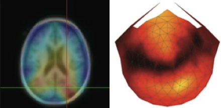

## PSY 511 {.flexbox .vcenter}

### Foundations of Cognitive and Affective Neuroscience

Rick O. Gilmore, Ph.D. 
Associate Professor of Psychology

## Today's topics

- Why neuroscience is harder than physics
- Course overview
- Methods in neuroscience

# Why neuroscience is harder than physics

---

---

## What do we need to know to answer the question?

## Brain & behavior are complex, dynamic *systems* with

- Components
- Interactions
- Forces/influences
- Boundaries
- Inputs/outputs/processes

## Systems...

- "Behave" or change state across time
- Return to starting state
- Appear to be regulated, controlled, influenced by feedback loops

## May be thought of as [networks](https://en.wikipedia.org/wiki/Network_science)

---

## Studying systems is hard because...

- Single parts -> multiple functions
- Single functions -> multiple parts
- Change structure/function over time (learning, development)
- Biological systems not "designed" like human-engineered ones
- Measuring what is being exchanged? What is being controlled? 

# Course overview

## Goals

- Master fundamentals of neuroscientific concepts and facts
- Prepare to read primary source literature in behavioral, cognitive, affective, and clinical neuroscience

## Structure

<https://psu-psychology.github.io/psy-511-scan-fdns-2017>

## Questions

- What is the basic plan of the nervous system?
- How do neurons work?
- How do neurons connected in networks achieve behavioral goals?
- How does the nervous system develop? How has it evolved?

## Approach

### Brain architecture (neuroanatomy)
### Brain function (neurophysiology)
### Brain communication (neurochemistry)
### Changes over evolutionary and developmental time

## Approach

- The nervous system as information processing system
- **Inputs**
    - From environment, body, brain
- **Processing**
    - Current inputs + brain state + body state + possible future states...
    - Stored information
    - Physiological & behavioral goals

---

- **Outputs**
    - To brain, body, environment
  
## Cajal/Swanson Architecture {.flexbox .vcenter}

# Neuroscience methods

## Evaluating methods 

### What is the question?

- Structure X -> Structure Y
- Structure X -> Function Y

### What are we measuring?

- Structure
- Activity

## Evaluating methods

### Strengths & Weaknesses

- Cost
- Invasiveness
- Spatial/temporal resolution

## Spatial resolution {.flexbox .vcenter}

<http://ai.ato.ms/MITECS/Images/churchland.figure1.gif>

## Types of methods

### Structural 

- Anatomy
- Connectivity/connectome

### Functional (next time)

- What does it do?
- Physiology/Activity

## Mapping structures

- Cell/axon stains
- Golgi stain -- whole cells
- Cellular distribution, concentration, microanatomy

---

<http://connectomethebook.com/wp-content/uploads/2011/11/Brainforest17_1119.jpg>

## Mapping structures

- Computed axial tomography (CAT), CT
- X-ray based

---

<http://img.tfd.com/mk/T/X2604-T-22.png>

## Tomography {.flexbox .vcenter}

<http://static.howstuffworks.com/gif/cat-scan-pineapple.jpg>

## Magnetic Resonance Imaging

- Magnetic resonance a property of some isotopes and complex molecules
- In magnetic field, absorb and release radio frequency energy
- Hydrogen, common in water & fat, is one
- Aligns with strong magnetic field
- When perturbed, speed of realignment varies by tissue
- Realignment gives off radio frequency (RF) signals
- Strength of RF ~ density

## MRI {.flexbox .vcenter}

<http://s.hswstatic.com/gif/mri-steps.jpg>

## Structural MRI

- Tissue density/type differences
- Gray vs. white - Axon fibers
- Spectroscopy
- Region sizes/volumes (volume-based morphometry or VBM)

---

Volume differences in schizophrenic patients vs. controls

[@Pomarol-Clotet2010-tq]

## What is the wiring diagram ("connectome")?

The idea is analogous to electronics. We want the schematic. Without the schematic, we can't really tell what the thing does.

---

## Retrograde (output -> input) vs. anterograde (input -> output) tracers

<http://openi.nlm.nih.gov/imgs/512/348/3176268/3176268_1471-2105-12-351-2.png>

---

<iframe width="560" height="315" src="https://www.youtube.com/embed/nvXuq9jRWKE" frameborder="0" allowfullscreen></iframe>

## Diffusion Tensor Imaging (DTI)

- Structural MRI technique
- Diffusion tensor: measurement of spatial pattern of $H_2O$ diffusion in small volume
- Uniform ("isotropic") vs. non-uniform ("anisotropic")
- Strong anisotropy suggests large # of axons with similar orientations (fiber tracts)

---

Here's an illustration of what a tensor looks like. You can see an isotropic and an anisotropic tensor.

---

And here's how we go from a tensor to estimating the pathway of a fiber tract.

---

## Connectome as matrix

---

## Main points

- Psychology is harder than physics
- Understanding brain/behavior relations requires a diverse toolkit

## Your turn

1. Pick two papers you want to read and (better) understand
    - Email me APA formatted citation (with DOIs)
    - Indicate three concepts/terms you are especially interested in understanding
2. Choose a behavior or mental state you want to (better) understand
    - Take an information processing perspective and briefly sketch out (in no more than a short paragraph) the main inputs, outputs, and computations involved. 

## References {.smaller}
