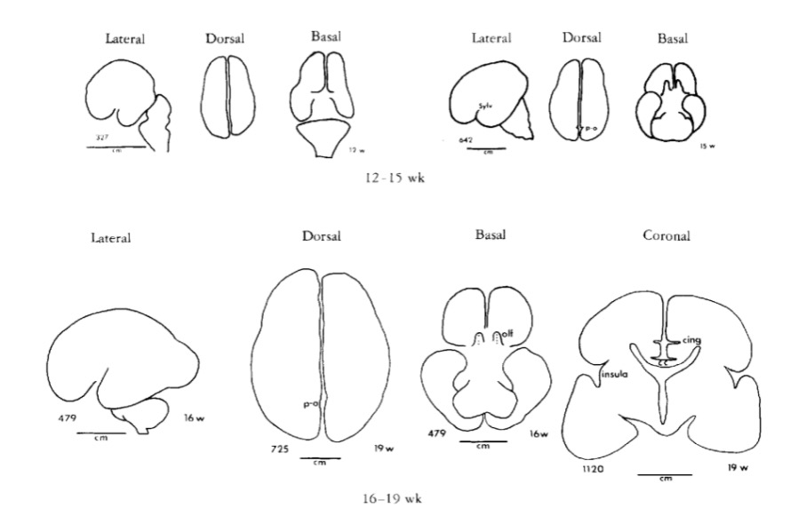
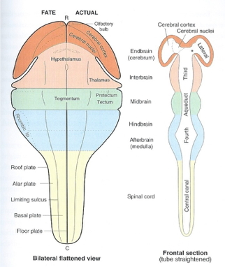

## Today's Topics

- Development of the nervous system

# Prenatal brain development

## Insemination

- 3-4 days before or up to 1-2 days after...
    + Ovulation

## Fertilization

- Within ~ 24 hrs of ovulation

## Implantation

- ~ 6 days after fertilization

## Early embryogenesis

<iframe width="560" height="315" src="https://www.youtube.com/embed/dAOWQC-OBv0" frameborder="0" allowfullscreen></iframe>

## Formation of *neural tube* (neurulation)

- Embryonic layers: ectoderm, mesoderm, endoderm
- ~18-26 days
- Failures of neural tube closure
    + Spina bifida
    + Anencephaly
- Neural tube becomes
    + Ventricles
    + Central canal of spinal cord

## Neurogenesis and gliogenesis

- Neuroepithelium cell layer lines neural tube
- Neural stem cells 
      - Undergo symmetric & asymmetric cell division
      - Generate glia, neurons, and basal progenitor cells
      
---

[[@Gotz2005-yj]](http://doi.org/http://dx.doi.org/10.1038/nrm1739)

## Zika and microcephaly

<iframe src="http://www.cdc.gov/ncbddd/birthdefects/microcephaly.html">
</iframe>

## Radial glia

## Cell migration

## Radial unit hypothesis {.smaller}

[[@rakic2009evolution]](http://dx.doi.org/10.1038/nrn2719)

## Migration

<iframe width="420" height="315" src="https://www.youtube.com/embed/ZRF-gKZHINk" frameborder="0" allowfullscreen></iframe>

## Migration

<iframe width="420" height="315" src="https://www.youtube.com/embed/t-8bxeWqSV4" frameborder="0" allowfullscreen></iframe>

## Glial migration {.smaller}

<http://physrev.physiology.org/content/81/2/871>

## Axon growth cone

<iframe width="420" height="315" src="https://www.youtube.com/embed/Fgmt2RBow0I" frameborder="0" allowfullscreen></iframe>

## Axons follow

- Chemoattractants
    + e.g., Nerve Growth Factor (NGF)
- Chemorepellents
- Receptors in growth cone detect chemical gradients

## Differentiation

- Neuron vs. glial cell
- Cell type
- NTs released
- Where to connect

## Differential gene expression in PFC vs. other {.smaller}

[[johnson2009functional]](http://dx.doi.org/10.1016/j.neuron.2009.03.027)

# Infancy & Early Childhood

## Synaptogenesis

## Proliferation, pruning

- Early proliferation
- Later pruning
- Rates, peaks differ by area

## Apoptosis

- Programmed cell death
- 20-80%, varies by area
- Spinal cord >> cortex
- Quantity of nerve growth factors (NGF) influences

## Apoptosis and cortical expansion  {.smaller}

[[@rakic2009evolution]](http://dx.doi.org/10.1038/nrn2719)

## Synaptic rearrangement

## Synaptic rearrangement

- Progressive phase: growth rate >> loss rate
- Regressive phase: growth rate << loss rate

## Myelination {.smaller}

<http://d6igaq6njxgjh.cloudfront.net/content/physrev/81/2/871/F6.large.jpg>

## Myelination

- Neonatal brain largely unmyelinated
- Gradual myelination, peaks in mid-20s
- Non-uniform pattern
    - Spinal cord before brain
    - Sensory before motor
    
## Gyral development {.smaller}

[[@Chi1977-hm]](http://doi.org/10.1002/ana.410010109)

---

[[@Chi1977-hm]](http://doi.org/10.1002/ana.410010109)

---

[[@Chi1977-hm]](http://doi.org/10.1002/ana.410010109)

---

[[@Chi1977-hm]](http://doi.org/10.1002/ana.410010109)

## Structural development

[[@Knickmeyer2008-vl]](http://doi.org/10.1523/JNEUROSCI.3479-08.2008)

## Postnatal patterns of synaptogenesis

## Myelination across human development {.smaller}

[[@Hagmann02112010]](http://doi.org/10.1073/pnas.1009073107)

## Networks in the brain {.smaller}

[[@10.3389/fnhum.2014.00051]](http://doi.org/10.3389/fnhum.2014.00051)

## Functional connectivity

- Age-related increases within visual-related areas [[@Petrican2017-re]](http://doi.org/10.1016/j.neuroimage.2017.09.025)

---

---

Age-related profiles in connectivity among "control networks."

---

Age-related profiles in connectivity among "non-control networks."

## The "development" of developmental connectomics {.smaller}

[[@Cao2017-bl]](http://doi.org/10.1016/j.tins.2017.06.003)

## Myelination changes "network" properties {.smaller}

[[@Hagmann02112010]](http://doi.org/10.1073/pnas.1009073107)

## Synaptic rearrangment, myelination change cortical thickness

- [[@Gogtay2004-bq]](http://doi.org/10.1073/pnas.0402680101)
- Areal differences in cortical thickness change

## [[@Gogtay2004-bq]](http://doi.org/10.1073/pnas.0402680101)

<video width="320" height="240" controls>
  <source src="mov/02680Movie1.mp4" type="video/mp4">
Your browser does not support the video tag.
</video>

<video width="320" height="240" controls>
  <source src="mov/02680Movie2.mp4" type="video/mp4">
Your browser does not support the video tag.
</video>

<video width="320" height="240" controls>
  <source src="mov/02680Movie3.mp4" type="video/mp4">
Your browser does not support the video tag.
</video>

<video width="320" height="240" controls>
  <source src="mov/02680Movie4.mp4" type="video/mp4">
Your browser does not support the video tag.
</video>

---

[[@Shaw2008-dq]](https://doi.org/10.1523/JNEUROSCI.5309-07.2008)

Sampling in Shaw et al 2008 study

---

[[@Shaw2008-dq]](https://doi.org/10.1523/JNEUROSCI.5309-07.2008)

Illustrations of cubic, quadratic, and linear changes in cortical thickness.

---

[[@Shaw2008-dq]](https://doi.org/10.1523/JNEUROSCI.5309-07.2008)

Illustrations of cubic, quadratic, and linear changes in cortical thickness from Shaw et al. 2008.

---

[[@Shaw2008-dq]](https://doi.org/10.1523/JNEUROSCI.5309-07.2008)

Illustrations of cubic, quadratic, and linear changes in medial frontal lobe cortical thickness from Shaw et al. 2008.

<!-- Scrolling final reference page -->
<!-- http://stackoverflow.com/q/38260799 -->

## Changes in brain energetics

[[@Kuzawa2014-qd]](http://doi.org/10.1073/pnas.1323099111)

Glucose utilization across age.

# Summary of developmental milestones

## Prenatal

+ Neuro- and gliogenesis
+ Migration
+ Synaptogenesis begins
+ Differentiation
+ Apoptosis
+ Myelination begins
+ Infant gene expression ≠ Adult

## Postnatal

+ Synaptogenesis
+ Cortical expansion, activity-dependent change
- Then cubic, quadratic, or linear declines in cortical thickness
+ Myelination
+ Connectivity changes (esp within networks)
+ Prolonged period of postnatal/pre-reproductive development [[@konner_evolution_2011]](http://www.hup.harvard.edu/catalog.php?isbn=9780674062016)

# How brain development clarifies anatomical structure

## 3-4 weeks

## 4 weeks {.smaller}

<https://upload.wikimedia.org/wikipedia/commons/4/4c/4_week_embryo_brain.jpg>

## ~4 weeks

## 6 weeks {.smaller}

<https://upload.wikimedia.org/wikipedia/commons/thumb/3/33/6_week_human_embryo_nervous_system.svg/500px-6_week_human_embryo_nervous_system.svg.png>

## ~6 weeks

## Beyond

## Organization of the brain

| Major division | Ventricular Landmark | Embryonic Division | Structure       |
|----------------|----------------------|--------------------|-----------------|
| Forebrain      | Lateral              | Telencephalon      | Cerebral cortex |
|                |                      |                    | Basal ganglia   |
|                |                      |                    | Hippocampus, amygdala |
|                | Third                | Diencephalon       | Thalamus        |
|                |                      |                    | Hypothalamus    |
| Midbrain       | Cerebral Aqueduct    | Mesencephalon      | Tectum, tegmentum |

## Organization of the brain

| Major division | Ventricular Landmark | Embryonic Division | Structure         |
|----------------|----------------------|--------------------|-------------------|
| Hindbrain      | 4th                  | Metencephalon      | Cerebellum, pons  |
|                | --                   | Mylencephalon      | Medulla oblongata |

## From structural development to functional development {.smaller}

[[@Johnson2001-yy]](http://doi.org/10.1038/35081509)

## Next time...

- Perception

## References {.smaller}
