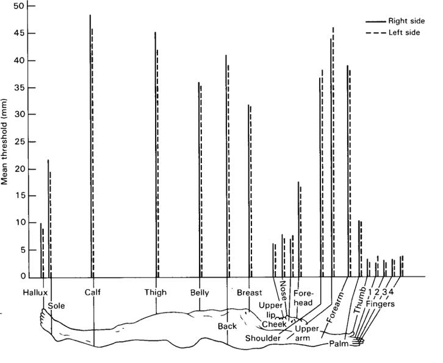
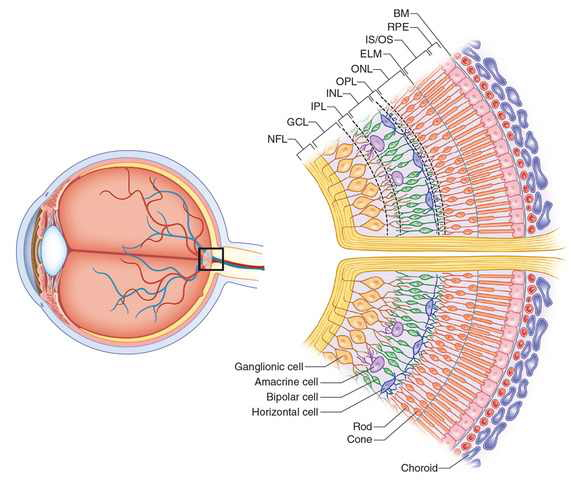

```{r setup, include=FALSE}
knitr::opts_chunk$set(echo = FALSE)
```

## Prelude

<iframe width="560" height="315" src="https://www.youtube.com/embed/FscIgtDJFXg" frameborder="0" allowfullscreen></iframe>

<div class="centered">
I can see clearly now.
</div>

## Today's topics

- Common principles in sensation & perception
- Case study: Vision

## Common Principles

- Topographic maps

<div class="notes">
The arrangement of sensory neurons across a sensory surface usually follows some sort of pattern. This often results in "maps" of different parts of the sensory surface that can be found all the way up the processing chain to the brain. In fact, the brain contains lots of different types of maps.
</div>

## Tonotopic (frequency) maps in auditory cortex {.smaller}

<div class="centered">


<http://www.his.kanazawa-it.ac.jp/~tomi/public/MEGLab/Auditory/tonotopy.gif>
</div>

<div class="notes">
In the auditory cortex, there is a map of cells that respond to different sound frequencies.
</div>

## Retinotopic maps in visual cortex {.smaller}

<div class="centered">


<http://jov.arvojournals.org/data/Journals/JOV/933499/jov-3-10-1-fig001.jpeg>
</div>

<div class="notes">
In the visual cortex, there is a topographic map of the retina called a retinotopic map. Here, the map is being measured using fMRI. It turns out that the size of these maps differs by a factor of 2 among different adults.
</div>

## Common principles

- Non-uniform sensitivity

<div class="notes">
Another common principle is that of non-uniform sensitivity.
</div>

## Two-point touch thresholds

<div class="centered">


<http://jov.arvojournals.org/data/Journals/JOV/933499/jov-3-10-1-fig001.jpeg>
</div>

<div class="notes">
For example, your ability to detect small spatial differences in skin stimulation varies considerably across the body, lowest on the back of your calf, and highest on your fingertips.
</div>

## Acuity variations across visual field {.smaller}

<div class="centered">


<https://upload.wikimedia.org/wikipedia/commons/thumb/2/27/AcuityHumanEye.svg/270px-AcuityHumanEye.svg.png>
</div>

<div class="notes">
We don't often notice it, but our visual acuity falls off rapidly away from the center of our visual field.
</div>

## Hearing threshold varies across frequency {.smaller}

<div class="centered">


<http://www.hearforever.org/userfiles/image/tools_to_learn/SS4_Hearing_Sensitivity.jpg>
</div>

<div class="notes">
And, some animals hear frequencies we just can't, and vice versa.
</div>

## Hierarchical processing

<div class="centered">

</div>

<div class="notes">
There is a common hierarchy of processing among sensory signals. Most originate in the periphery, project through sense-specific regions of the thalamus, and then go to sensory-specific regions of the cerebral cortex.
</div>

## Parallel processing

<div class="centered">

</div>

<div class="notes">
But there is also a lot of parallel processing going on even among sensory systems. 
</div>

## Parallel processing

<div class="centered">

</div>

<div class="notes">
For example, when you hold a hot coffee cup, there are separate channels providing information about the cup's temperature, whether it is painfully hot or not, the cup's texture, and weight.

How does the brain put these separate pieces into a coherent whole? That's a great question, and we'll start to answer next time.
</div>

# Case study: Vision

## Electromagnetic (EM) radiation {.smaller}

<div class="centered">


<http://en.wikipedia.org/wiki/File:EM_Spectrum_Properties_edit.svg>
</div>

## Features of EM radiation

- Wavelength/frequency
- Intensity
- Location/position of source
- Reflects off some materials
- Refracted (bent) moving through other materials

## EM radiation provides information across space (and time)

<div class="centered">
<a href="http://apod.nasa.gov/apod/ap140605.html"></a>
</div>

<div class="notes">
Example is Hubble Deep Field that peers back into a time close to the origin of our universe some 13.7 billion years ago.
</div>

## Reflectance spectra differ by surface {.smaller}

<div class="centered">


<http://http://www.vgt.vito.be/userguide/book_1/4/42/ie42bd.gif>
</div>

## [Optic array](https://en.wikipedia.org/wiki/Ambient_optic_array) specifies geometry of environment

<div class="centered">

</div>

## Color == categories of wavelength

- Eyes categorize wavelength into relative intensities within wavelength bands
- RGB ~ <span class="red">**R**ed</span>, <span class="green">**G**reen</span>, <span class="blue">**B**lue</span>
    + Long, medium, short wavelengths
- *Color is a neural/psychological construct*

## RGB monitors

<div class="centered">

</div>

## How a camera works

<div class="centered">

</div>

## The biological camera

<div class="centered">

</div>

## The biological camera

<div class="centered">

</div>

## Parts of the eye

- *Cornea* - refraction (2/3 of total)
- *Pupil* - light intensity; diameter regulated by Iris.
- *Lens* - refraction (remaining 1/3; focus)

## Parts of the eye

- *Retina* - light detection
    + ~ skin or organ of Corti
- *Pigment epithelium* - regenerate photopigment
- *Muscles* - move eye, reshape lens, change pupil diameter

## Eye forms image on retina

- Image inverted (up/down)
- Image reverseed (left/right)
- Point-to-point map (*retinotopic*)
- Binocular and monocular zones

## Retinal image

<div class="centered">

</div>

## Eyes views overlap

<div class="centered">

</div>

## The *fovea* {.smaller}

<div class="centered">


<http://www.brainhq.com/sites/default/files/fovea.jpg>
</div>

## The fovea

- Central 1-2 deg of visual field
- Aligned with visual axis
- *Retinal ganglion cells* pushed aside
- Highest *acuity* vision == best for details

## Acuity varies across fovea

<div class="centered">

</div>

## Acuity varies across fovea {.smaller}

<div class="centered">


<http://michaeldmann.net/pix_7/blndspot.gif>
</div>

## What part of the skin is like the fovea?

## What part of the skin is like the fovea?

<div class="centered">


<http://jov.arvojournals.org/data/Journals/JOV/933499/jov-3-10-1-fig001.jpeg>
</div>

## *Photoreceptors* detect light

<div class="centered">

</div>

## Photoreceptors detect light

- *Rods*
    + ~120 M/eye
    + Mostly in periphery
    + Active in low light conditions
    + One wavelength range
    
## Photorceptors detect light

- *Cones*
    + ~5 M/eye
    + Mostly in center
    + 3 wavelength ranges
    
## Photoreceptors "specialize" in particular wavelengths {.smaller}

<div class="centered">


Anatomy & Physiology, Connexions Web site. http://cnx.org/content/col11496/1.6/, Jun 19, 2013.
</div>
    
## How photoreceptors work

- Outer segment
    + Membrane disks
    + *Photopigments*
        - Sense light, trigger chemical cascade
- Inner segment
    + Synaptic terminal
- Light *hyperpolarizes* photoreceptor!
    + The *dark current*
    
## Retina

- Physiologically *backwards*
    + How?
- Anatomically *inside-out*
    + How?
  
## Retina

- Physiologically *backwards*
    + <span class="red>Dark current</span>
- Anatomically *inside-out*
    + <span class="red">Photoreceptors at back of eye</span>

## Retinal layers {.smaller}

<div class="centered">


<http://www.retinareference.com/anatomy/>
</div>

## Retinal layers

- From photoreceptors...
- To *Bipolar cells*
    + <-> and *Horizontal cells*
- To *Retinal ganglion cells*
    + <-> and *Amacrine cells*

## *Center-surround receptive fields*

<div class="centered">

</div>

## Center-surround receptive fields

- Center region
    + Excites (or inhibits)
- Surround region
    + Does the opposite
- Bipolar cells & Retinal Ganglion cells ->
- Most activated by "donuts" of light/dark
    + Local contrast (light/dark differences)

## What's a reddish-green look like? {.flexbox .vcenter}

<div class="centered">

</div>

## What's a reddish-green look like? {.flexbox .vcenter}

<div class="centered">

</div>

## *Opponent processing* {.smaller}

<div class="centered">


<http://www.visualexpert.com/sbfaqimages/RGBOpponent.gif>
</div>

## Opponent processing

- Black vs. white (achromatic)
- Long (red) vs. Medium (green) wavelength cones
- (Long + Medium) vs. Short cones
- Can't really see reddish-green or bluish-yellow
    - "Oppose" one another at cellular/circuit level

## From eye to brain

<div class="centered">

</div>

## From eye to brain

- Retinal ganglion cells
- 2nd/II cranial (optic) nerve
    + Optic chiasm ($\chi$ - asm): Partial crossing of fibers
    + Nasal hemiretina (lateral/peripheral visual field) cross
    + Left visual field (from L & R retinae) -> right hemisphere & vice versa
- *Lateral Geniculate Nucleus (LGN)* of thalamus (receives 90% of retinal projections)

## From eye to brain

- Hypothalamus
    + *Suprachiasmatic nucleus* (superior to the optic chiasm): Synchronizes day/night cycle with circadian rhythms
- Superior colliculus & brainstem

## LGN

<div class="centered">

</div>

## LGN

- 6 layers + intralaminar zone
    + Parvocellular (small cells): chromatic 
    + Magnocellular (big cells): achromatic
    + Koniocellular (chromatic - <span color="blue">short</span> wavelength?)
- Retinotopic map of opposite visual field

## From LGN to V1

<div class="centered">

</div>

## From LGN to V1

- Via *optic radiations*
- *[Primary visual cortex (V1)](http://www.scholarpedia.org/article/Area_V1)* in occipital lobe
- Create "stria of Gennari" (visible stripe in layer 4)
- Calcarine fissure (medial occiptal lobe) divides lower/upper visual field

## Human V1 {.smaller}

<div class="centered">


<http://www.scholarpedia.org/w/images/3/3a/03-Human-V1.png>
</div>

## Measuring retinotopy in V1 {.smaller}

<div class="centered">


[[@dougherty_visual_2003]](http://dx.doi.org/10.1167/3.10.1)
</div>

## Retinotopy in V1

- Fovea overrepresented
    + Analogous to somatosensation
    + High acuity in fovea vs. lower outside it
- Upper visual field/lower (ventral) V1 and *vice versa*

## V1 has laminar, columnar organization

<div class="centered">

</div>

## V1 has laminar, columnar organization

- 6 laminae (layers)
    + Input: Layer 4 (remember stria of Gennari?)
    + Output: Layers 2-3 (to cortex), 5 (to brainstem), 6 (to LGN)

## V1 has laminar, columnar organization

- Columns
    + Orientation/angle
    + Spatial frequency
    
## The "accidental" discovery of oriented receptive fields in V1

<iframe width="560" height="315" src="https://www.youtube.com/embed/IOHayh06LJ4" frameborder="0" allowfullscreen></iframe>
    
## Orientation/angle tuning {.smaller}

<div class="centered">


<https://foundationsofvision.stanford.edu/wp-content/uploads/2012/02/dir.selective.png>
</div>

## From center-surround receptive fields to line detection {.smaller}

<div class="centered" height=450px>

</div>

## Spatial frequency tuning {.smaller}

<div class="centered">
Low == gist    ||     high == details


[[@panichello_predictive_2013]](http://dx.doi.org/10.3389/fpsyg.2012.00620)
</div>

## V1 has laminar, columnar organization

- Columns
    + Color/wavelength
    + Eye of origin, *ocular dominance*
    
## Ocular dominance columns

<div class="centered">

</div>

## Ocular dominance signals retinal disparity

<iframe width="560" height="315" src="https://www.youtube.com/embed/KjAQdc29vF8" frameborder="0" allowfullscreen></iframe>


<http://www.scholarpedia.org/w/images/9/99/11-Hubel-Wiesel-model.png>
</div>

## Beyond V1

<div class="centered" height=450px>

</div>

## Beyond V1

- Larger, more complex receptive fields
- *Dorsal stream* (where/how)
    + Toward parietal lobe
- *Ventral stream* (what)

## What is vision for?

- What is it? (form perception)
- Where is it? (space perception)
- How do I get from here to there (action control)
- What time (or time of year) is it?

## Next time...

- Principles of action