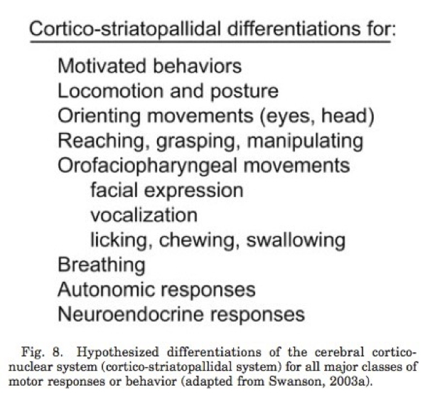
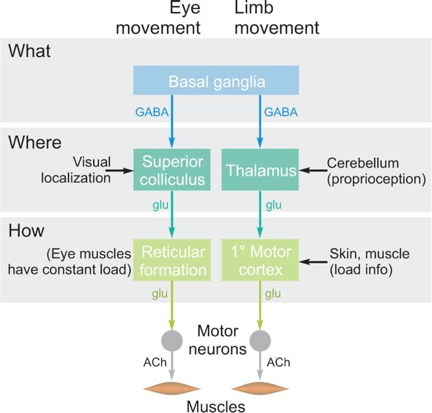
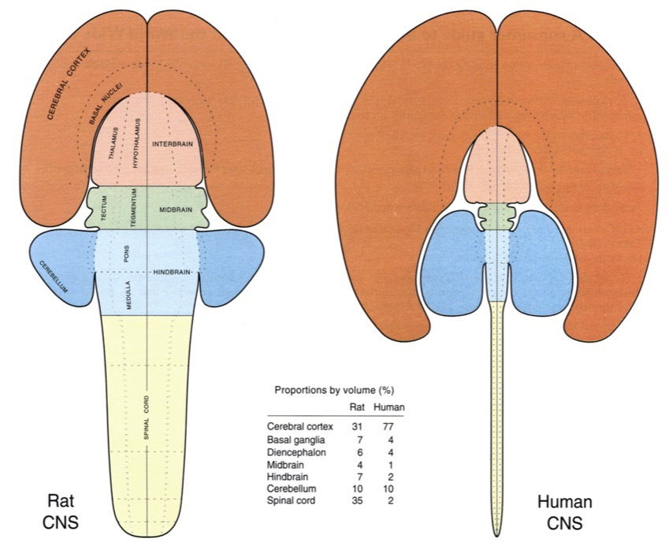
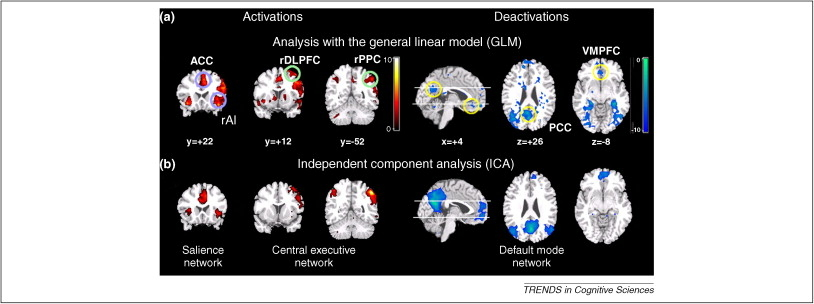
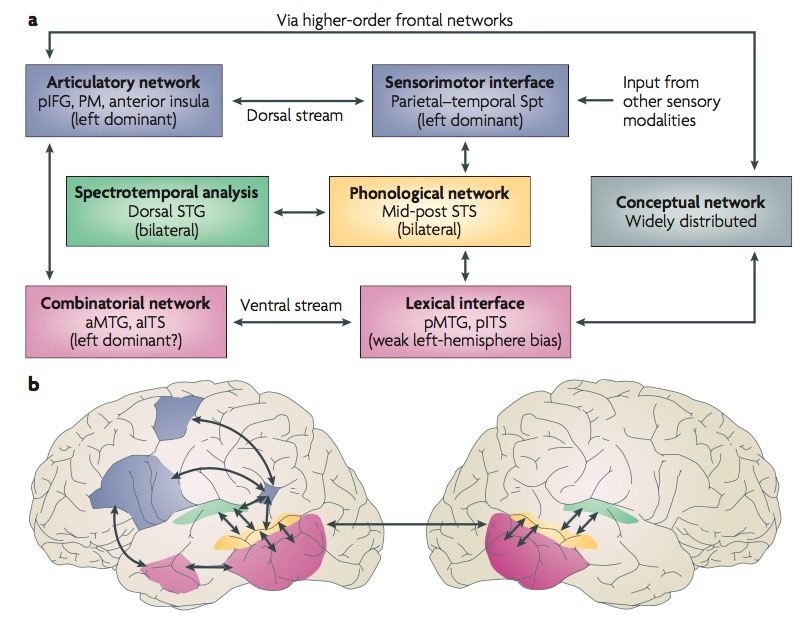
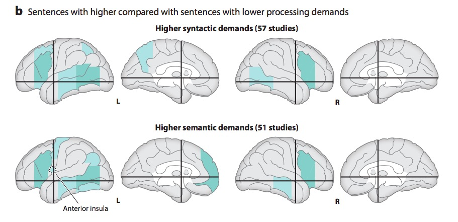
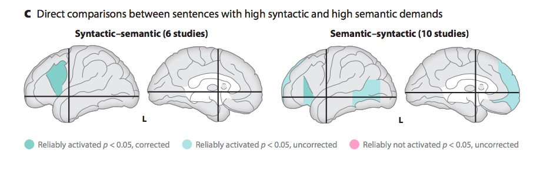

## Today's Topics

- Cognition

## The emergence of behavior

## Cambrian Explosion

<iframe width="560" height="315" src="https://www.youtube.com/embed/qNtQwUO9ff8" frameborder="0" allowfullscreen></iframe>

## What sparked the explosion? [[@fox_what_2016]](http://doi.org/10.1038/530268a)

- Behavior requires energy
- Behavior requires perception at a distance
- Behavior requires action
- Actions require
    - Problem solving, (sequence) planning
    - Current + stored information (memory)

## What behaviors are essential for animals to perform?

- Ingestion
- Defense
- Reproduction

## What behaviors are essential for animals to perform

- Perception at a distance
- Locomotion
- Object manipulation/consumption
- Signaling/communication

## How is the nervous system organized to contribute to these behaviors?

## Cajal

## Swanson/Cajal four systems

## Hierarchy of control {.smaller}

[[@swanson2005anatomy]](http://dx.doi.org10.1002/cne.20733)

## Functional segregation {.smaller}

[[@swanson2005anatomy]](http://dx.doi.org10.1002/cne.20733)

## Do what, where, how? {.smaller}

[[@swanson2012brain]](https://books.google.com/books?hl=en&lr=&id=tAk8Rr00kykC&oi=fnd&pg=PP2&dq=larry+swanson+book&ots=5F7nEnts45&sig=DJLKh5BF_8aVqpOdK28Qmh1wr5Q#v=onepage&q=larry%20swanson%20book&f=false)

## Facets of cognition

- Perception
- Attention
- Imagery

## Facets of cognition

- Learning and conditioning
- Memory
    + Episodic
    + Semantic
    + Procedural
- Language
- Problem-solving

## Cognition and the cerebral cortex {.smaller}

[[@swanson2012brain]](https://books.google.com/books?hl=en&lr=&id=tAk8Rr00kykC&oi=fnd&pg=PP2&dq=larry+swanson+book&ots=5F7nEnts45&sig=DJLKh5BF_8aVqpOdK28Qmh1wr5Q#v=onepage&q=larry%20swanson%20book&f=false)

## Cortical schema

- Areas
    + Unimodal sensory
    + Polymodal association
    + Motor
- Connections
    + Association
    + Commissural

## Cortical areas {.smaller}
    

[[@swanson2012brain]](https://books.google.com/books?hl=en&lr=&id=tAk8Rr00kykC&oi=fnd&pg=PP2&dq=larry+swanson+book&ots=5F7nEnts45&sig=DJLKh5BF_8aVqpOdK28Qmh1wr5Q#v=onepage&q=larry%20swanson%20book&f=false)

## Cortical schema

- Columnar structure
- Cytoarchitectonic differerences (e.g. Brodmann)

## Cortical columns {.smaller}

<https://upload.wikimedia.org/wikipedia/commons/thumb/5/5b/Cajal_cortex_drawings.png/518px-Cajal_cortex_drawings.png>

## Cortical layers {.smaller}

<http://s27.photobucket.com/user/caiomaximino/media/layerscortex.jpg.html>

## Cortical connections by layer

| Layer | Connection type | Comments |
|-------|-----------------|----------|
| I     |                 | Few cell bodies         |
| II    | Efferent  | Ipsilateral association via large pyramidal cells |
| III   | Efferent        | Contralateral commissural |
| IV    | Afferent        | from thalamus; small stellate & granual cells; V1 has sublayers |
| V     | Efferent        | Superficial -> Basal ganglia; Deep -> brainstem, spinal cord; pyramidal cells |
| VI    | Efferent        | Thalamus |
    
## Cortical circuit schematic {.smaller}

[[@swanson2012brain]](https://books.google.com/books?hl=en&lr=&id=tAk8Rr00kykC&oi=fnd&pg=PP2&dq=larry+swanson+book&ots=5F7nEnts45&sig=DJLKh5BF_8aVqpOdK28Qmh1wr5Q#v=onepage&q=larry%20swanson%20book&f=false)

## Behavioral control column {.smaller}

[[@swanson2005anatomy]](http://dx.doi.org10.1002/cne.20733)

## Behavioral control column {.smaller}

[[@swanson2005anatomy]](http://dx.doi.org10.1002/cne.20733)

## Behavioral control column {.smaller}

[[@swanson2005anatomy]](http://dx.doi.org10.1002/cne.20733)

## Behavioral control column {.smaller}

[[@swanson2005anatomy]](http://dx.doi.org10.1002/cne.20733)

## Behavioral control column {.smaller}

[[@swanson2005anatomy]](http://dx.doi.org10.1002/cne.20733)

## Processing networks

>"*Although it has long been assumed that cognitive functions are attributable to the isolated operations of single brain areas, we demonstrate that the weight of evidence has now shifted in support of the view that cognition results from the dynamic interactions of distributed brain areas operating in large-scale networks....*"

[[@bressler2010large]](http://dx.doi.org/10.1016/j.tics.2010.04.004)

## [[@bressler2010large]](http://dx.doi.org/10.1016/j.tics.2010.04.004) 

## [[@bressler2010large]](http://dx.doi.org/10.1016/j.tics.2010.04.004) 

## [[@bressler2010large]](http://dx.doi.org/10.1016/j.tics.2010.04.004) 

## [[@bressler2010large]](http://dx.doi.org/10.1016/j.tics.2010.04.004) 

## Summary

- Cognition
    + Do what, where, when, and how
- The "cognitive" cortex
- Processing networks
    + Functional specialization
    + Dynamic interaction

# Language and the brain

## Language behavior

<iframe width="560" height="315" src="https://www.youtube.com/embed/4X4Fy8YqysY?rel=0&amp;start=160" frameborder="0" allowfullscreen></iframe>

## Language behavior

- Productive
    - Speaking (2-5 words/s), modulate prosody, often combined with gesture
    - Writing, typing (.5-1.5 words/s)
- Receptive
    - Listening, responding (facial expressions, gestures, laughter, etc.)
    - Reading (3-5 words/s)
- How so fast? Time for feedback?

## Hierarchical structure of language information

- Phonetic
    - |Ber| |wiTH| |mē|
- Syntactic
- Semantic

---

## Hierarchical structure of language information

- Pragmatic
    - "I beg your pardon?!"
    - "Sure thing."
    - "Aaaaaa!!!"

## Wernicke-Geschwind model

- Perception ≠ production

---

## Wernicke-Geschwind model

- Wernicke's area
    - Perception
    - Adjacent to primary auditory cortex (A1; Heschl's gyrus; BA 41)
    - Wernicke's area (BA 42)

---

---

## Wernicke-Geschwind model

- Wernicke's area
    - Perception
    - Adjacent to primary auditory cortex (A1; Heschl's gyrus; BA 41)
    - Wernicke's area (BA 42)
    - Receptive or fluent aphasia

---

<iframe width="560" height="315" src="https://www.youtube.com/embed/dKTdMV6cOZw?rel=0" frameborder="0" allowfullscreen></iframe>

## Wernicke-Geschwind model

- Broca's area
    - Production
    - Inferior frontal gyrus, pars opercularis (BA 44) & pars angularis (BA 45)     - Expressive aphasia

---

---

<iframe width="560" height="315" src="https://www.youtube.com/embed/f2IiMEbMnPM" frameborder="0" allowfullscreen></iframe>

## [[@Hickok2007-rc]](http://doi.org/10.1038/nrn2113)

- Dual streams
    - Ventral (speech signals -> semantics)
    - Dorsal (speech signal acoustics -> articulatory networks in frontal lobe)

---

[[@Hickok2007-rc]](http://doi.org/10.1038/nrn2113)

## [[@Hagoort2014-au]](http://doi.org10.1146/annurev-neuro-071013-013847)

---

[[@Hagoort2014-au]](http://doi.org10.1146/annurev-neuro-071013-013847)

---

[[@Hagoort2014-au]](http://doi.org10.1146/annurev-neuro-071013-013847)

## Summing up

- WG model incomplete, simplistic
- Rapid, fluent comprehension and production of language relies on
    - Distributed temporal/frontal networks
    - Efficient bottom-up and top-down processing
    - Syntactic vs. semantic/articulatory processing

---

[[@Hagoort2014-au]](http://doi.org10.1146/annurev-neuro-071013-013847)

## Next time...

- Learning and memory
    + Distributed systems
    + Associative learning, NMDA receptors, and the hippocampus

## References {.smaller}