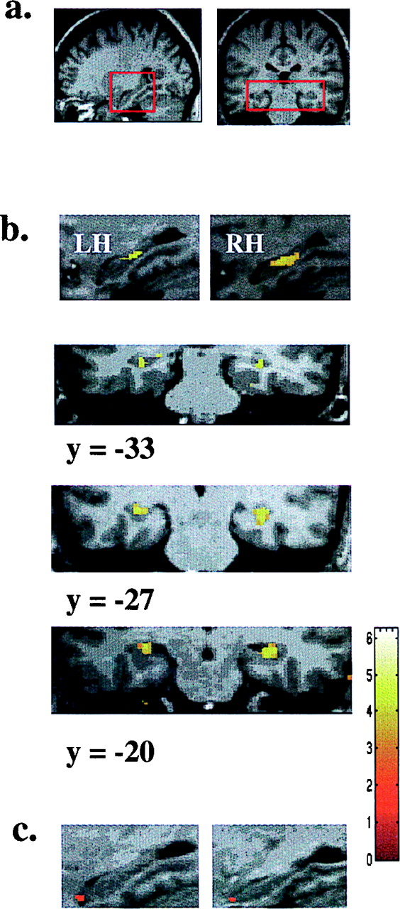

## Today's Topics

- Learning & memory

## Memory capacity of the human brain?

- 1e12 neurons
- 1e3 synapses/neuron
- 1e15 synapses or 1.25e14 bytes
- 1e9 gigabyte, 1e12 terabyte, 1e15 petabyte

<http://www.scientificamerican.com/article.cfm?id=what-is-the-memory-capacity>

## What is learning?

- Q: Acquisition of new or change in existing knowledge, skills, ...
- **Non-associative**
    - $A(t+1) = f(A(t))$
    - Habituation ($\dot f < 0$), sensitization ($\dot f > 0$)
- **Associative**
    - A -> B
    - Classical & operant/instrumental conditioning
    - Sequence, observational, episodic, semantic

## What is memory?

- A: Information encoding, storage, retrieval
- Dimensions
    - Short vs. long-term
        - Working memory ~ short-term maintenance for guiding action
    - Explicit (declarative: semantic vs. episodic) vs. implicit (procedural)
    - Retrospective (from the past) vs. prospective (to be remembered)
    - Recognition (familiar or novel) vs. recall

## Biological bases of L&M

- Changes in patterns of neural activity
- Changes in connectivity
    + New synapses
    + Altered synapses (strengthened or weakened)
- Computers have separate memory stores; brains store info everywhere
    
## Donald Hebb's Insight

> *When an axon of cell A is near enough to excite cell B and repeatedly or persistently takes part in firing it, some growth process or metabolic change takes place in one or both cells such that A’s efficacy, as on of the cells firing B, is increased.* (Hebb, 1949, p. 62)

> *Neurons that fire together wire together.* (Lowell & Singer, 1992, p. 211).

##  'Hebbian' learning via NMDA receptor

- *N-methyl-D-aspartate* receptor (NMDAR)
- 'Coincidence' detector
    + Sending cell has released NT
    + Receiving cell is/has been recently active
    
##  'Hebbian' learning

- Chemically-gated AND
    + Ligand- (glutamate/aspartate + glycine) gated
    + Sending cell active
- Voltage-gated
    + $Zn^{++}$ or $Mg^{++}$ ion 'plug' removed under depolarization
    + $Na^+$ & $Ca^{++}$ influx; $K^+$ outflux
    + Receiving cell responds

## NMDA receptor figure {.smaller}

<https://upload.wikimedia.org/wikipedia/commons/thumb/0/00/Activated_NMDAR.svg/220px-Activated_NMDAR.svg.png>

## NMDA clinical significance

- *Memantine* (Alzheimer's Disease treatment) blocks NMDAR
    - Controls over-activation and $Ca^{++}$ excitotoxicity?
- Implicated in effects of *phencylidine* (PCP)
    - Link to glu hypothesis of schizophrenia?

## NMDA clinical significance

- *Ketamine* is NMDA receptor antagonist
    - anesthesia, sedation pain relief
    - possible short-term relief for depression
- Analgesic effects of nitrous oxide (laughing gas; NO)
- Ethanol inhibits [[@Ron2011-dh]](https://www.ncbi.nlm.nih.gov/pubmed/21204417)

## But how to learn/remember "causal chains"?

- e.g., lightning THEN thunder
- unusual food THEN indigestion

## Spike-timing-dependent plasticity {.smaller}

[[@caporale2008spike]](http://dx.doi.org/10.1146/annurev.neuro.31.060407.125639)

   
## Spike-timing-dependent plasticity {.smaller}

[[@caporale2008spike]](http://dx.doi.org/10.1146/annurev.neuro.31.060407.125639)

## Spike-timing-dependent plasticity

- A before B: strengthen A->B
- A after B: weaken A->B
- [*Neural Plasticity*](https://en.wikipedia.org/wiki/Neuroplasticity)
    + Lasting changes in neural firing, connectivity
- NMDA receptor molecular mechanism for implementing LTP and spike-timing-dependent plasticity

## NMDA receptor function may vary by location on neuron

- Long-term potentiation (LTP)
    - Synaptic NMDA receptors
- Long-term depression (LTD)
    - Extrasynaptic NMDA receptors
    - Lowered level of synaptic receptor activation
    
## LTP discovery [[@Bliss1973-xx]](http://doi.org/10.1113/jphysiol.1973.sp010273/full)

- Granule cell neurons in hippocampus DG
- $\theta$ band (10–20 Hz) stim for 10–15 sec, or 100 Hz stim for 3–4 sec
- shortened response latency, increased EPSP, increased population response over minutes or hours

---

## Mechanisms of LTP plasticity

- number of synaptic receptors
- quantity of NT released
- effectiveness of postsynaptic response

## Pathways to plasticity

- $Ca^{++}$ entry activates protein kinases (CaMKII and PKAII)
- Early LTP
    - protein kinases *phosphorylate* (add $P$ group to) postsynaptic AMPA receptors
    - Increased current flow through AMPA (glu) receptors
- Late LTP
    - insertion of new receptors into membrane
- Retrograde signal generator influences presynaptic response

---

---

 
<!-- ## Dimensions of stored info -->

<!-- - Memory of what? -->
<!--     + Facts/events/places/feelings vs. skills -->
<!-- - Memory of when? -->
<!--     + Immediate vs. distant past -->
<!-- - Memory for how long? -->
<!--     + Seconds vs. years -->

## Memory systems in the brain {.smaller}

[[@squire_memory_2004]](http://dx.doi.org/10.1016/j.nlm.2004.06.005)

## Hippocampus {.smaller}

<https://upload.wikimedia.org/wikipedia/commons/5/5b/Hippocampus_and_seahorse_cropped.JPG>

## Hippocampus features

- Dense in NMDA receptors
- Central "hub" in network?
    - No, based on anatomical or functional connectivity
    - But yes, when modeling "information flow" [[@Misic2014-eq]](http://doi.org/10.1371/journal.pcbi.1003982)

## Hippocampus roles

- Formation, storage, consolidation of long-term episodic or declarative memories
- Stores info for later transfer to cortex
    - "Engrams" form in hipp & PFC simultaneously, fade in PFC over time [[@Kitamura2017-es]](http://doi.org/10.1126/science.aam6808)

## Hippocampus roles

- Spatial navigation
    + [Place cells](https://en.wikipedia.org/wiki/Place_cell)
    + [Grid cells](http://www.scholarpedia.org/article/Grid_cells)
    + [Head-direction cells](http://www.scholarpedia.org/article/Head_direction_cells)
## Spatial precision of place cells {.smaller}

[[@kjelstrup_finite_2008]](http://dx.doi.org/10.1126/science.1157086)

## Human analogue -- [[@maguire2000navigation]](http://dx.doi.org/10.1073/pnas.070039597) {.smaller}

[[@maguire2000navigation]](http://dx.doi.org/10.1073/pnas.070039597)

## [[@maguire2000navigation]](http://dx.doi.org/10.1073/pnas.070039597) {.smaller}

[[@maguire2000navigation]](http://dx.doi.org/10.1073/pnas.070039597)

## [[@maguire2000navigation]](http://dx.doi.org/10.1073/pnas.070039597) {.smaller}

[[@maguire2000navigation]](http://dx.doi.org/10.1073/pnas.070039597)

## Hippocampal volume in food-caching birds {.smaller}

[[@sherry_hippocampal_1989]](http://dx.doi.org/10.1159/000116516)

## Disorders of memory

## [Patient HM](http://www.pbs.org/wgbh/nova/body/corkin-hm-memory.html) (Henry G. Molaison)

- Intractable/untreatable epilepsy
- Bilateral resection of medial temporal lobe (1953)
- Epilepsy now treatable
- But, memory impaired
- Lived until 2008

## Brenda Milner tells the story

<iframe width="560" height="315" src="https://www.youtube.com/embed/JliczINA__Y" frameborder="0" allowfullscreen></iframe>

## HM's surgery

## Amnesia

- Acquired loss of memory
- ≠ normal forgetting
- Note: computers don't forget

## HM's amnesia

- Retrograde amnesia
    + Can’t remember 10 yrs before operation
    + Distant past better than more recent
- Severe, global anterograde amnesia
    + Impaired learning of new facts, events, people
- But, skills (mirror learning) intact
    
## Types of amnesia

- Retrograde ('backwards' in time)
    + Damage to information acquired pre-injury
    + Temporally graded
- Anterograde ('forward' in time) 
    + Damage to information acquired/experienced post-injury

## What it's like

*Every day is alone in itself, whatever enjoyment I’ve had, and whatever sorrow I’ve had…Right now, I’m wondering, have I done or said anything amiss?  You see at this moment, everything looks clear to me, but what happened just before?  That’s what worries me.  It’s like waking from a dream.  I just don’t remember.*

## What it's like

<iframe width="560" height="315" src="https://www.youtube.com/embed/Rq9eM4ZXRgs" frameborder="0" allowfullscreen></iframe>
    
## Other causes of amnesia

- Disease 
    + Alzheimer’s, herpes virus
- [Korsakoff’s syndrome](https://en.wikipedia.org/wiki/Korsakoff%27s_syndrome)
    + Result of severe alcoholism
    + Impairs medial thalamus & mammillary bodies

## Patient NA

- Fencing accident
- Damage to medial thalamus
- Anterograde + graded retrograde amnesia
- Are thalamus & medial temporal region connected?

## Patient NA

<iframe width="420" height="315" src="https://www.youtube.com/embed/1GfFopZSyj8" frameborder="0" allowfullscreen></iframe>

## Spared skills in amnesia

- Skill-learning
- Mirror-reading, writing
- Short-term memory
- “Cognitive” skills
- Priming

## What does amnesia tell us?

- Long-term memory for facts, events, people 
- ≠ Short-term memory
- ≠ Long-term memory for “skills”
- Separate memory systems in the brain?

## Alzheimer's Disease (AD)

- Chronic, neurodegenerative disease affecting ~5 M Americans
- Cognitive dysfunction (memory loss, language difficulties, planning, coordination)
- Psychiatric symptoms and behavioral disturbances
- Difficulties with daily living
- [[@burns_alzheimers_2009]](http://doi.org/10.1136/bmj.b158)

## AD progression

[[@burns_alzheimers_2009]](http://doi.org/10.1136/bmj.b158)

## AD

- Post-mortem exams show beta amyloid plaques and neurofibrillary tangles

## AD treatments include
    
- Acetylcholinesterase (AChE) inhbitors (e.g. Aricept)
- NMDAR partial antagonists (e.g., Memantine)
    
<!-- ## New hope for treatment, [[@kaufman_fyn_2015]](http://doi.org/10.1002/ana.24394) {.smaller} -->

<!-- 
 -->
<!--  -->

<!-- 
 -->

## What about working memory? [[@DEsposito2015-zm]](http://doi.org/10.1146/annurev-psych-010814-015031)

- LTM representations of target items + attention -> elevated activation
    - Semantic items
    - Sensorimotor items
- Capacity for attended items (in Focus of Attention or FoA) limited ~ 4

## What about working memory? [[@DEsposito2015-zm]](http://doi.org/10.1146/annurev-psych-010814-015031)
- Neural basis 
    - sustained activation in PFC
    - subthreshold activation in areas where items are stored

## Individual differences in visual WM [[@Luck2013-uo]](http://doi.org/10.1016/j.tics.2013.06.006)

## Summary

- Multiple types of learning & memory
- Learning & memory distributed across the brain
- Hippocampus + PFC critical areas binding together sensory/semantic info stored elsewhere
- Changes in synaptic #, strength, connectivity provide cellular basis

## References {.smaller}