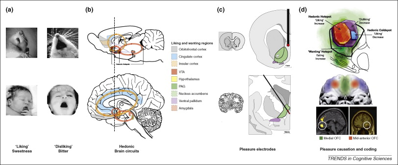

## Today's topics

- Fear
- Stress
- Reward

## Animal model of learned 'fear' {.smaller}

<http://www.cns.nyu.edu/labs/ledouxlab/images/image_research/fear_conditioning.jpg>

## Rat vs. Human {.smaller}

Adapted from [[@davis1992role]](http://dx.doi.org/10.1016/0165-6147(92)90014-W)

## Amygdala circuits {.smaller}

[[@medina2002parallels]](http://dx.doi.org/10.1038/nrn728)

## Specificity of learning

## Circuitry

## Brain under stress 

- **Acute** stress
    + Short duration
    + Fast action required
    + HPA (Cortisol), SAM (NE/Epi) axes
- Brain detects threat
- Mobilizes physiological, behavioral responses

## Brain under stress

- vs. **Chronic** stress
    + Long duration, persistent
    
## Glucocorticoids

- Adrenal cortex releases hormones
    + Cortisol (hydrocortisone)
        * Increases blood glucose levels
        * Suppresses immune system
        * Reduces inflammation
        * Aids in metabolism
    + Receptors in brain and body
    
## Cortisol and the brain {.smaller}

<http://www.molecularbrain.com/content/figures/1756-6606-3-2-1-l.jpg>

## Impacts of acute stress

## From cortisol to enhanced glutamate

# Pleasure/reward

## Neuroanatomy of 'happiness' {.smaller}

[[@kringelbach2009towards]](http://dx.doi.org/10.1016/j.tics.2009.08.006)

## Rewards

- A *reward* reinforces (makes more prevalent/probable) some behavior
- Milner and Olds [[@milner_discovery_1989]](http://doi.org/10.1016/S0149-7634(89)80013-2) discovered 'rewarding' power of electrical self-stimulation
- [[@heath1963electrical]](http://doi.org/10.1176/ajp.120.6.571) studied effects in human patients.

## Electrical self-stimulation

<iframe width="420" height="315" src="https://www.youtube.com/embed/de_b7k9kQp0" frameborder="0" allowfullscreen></iframe>

## "Reward" circuitry in the brain {.smaller}

[[@nestler2006mesolimbic]](http://dx.doi.org/10.1016/j.biopsych.2005.09.018)

## Components of the "reward" circuit

- Lateral Hypothalamus (Hyp)
- Medial forebrain bundle (MFB)
- Ventral tegmental area (VTA) in midbrain
- Nucleus accumbens (nAcc)
- Dorsal Raphe Nucleus/Locus Coeruleus (DR/LC)

## Components of the "reward" circuit

- Amygdala (Amy)
- Hippocampus (HP)
- Prefrontal cortex (PFC)

## Nucleus accumbens and dorsal striatum {.smaller}

[[@kohls2012social]](http://dx.doi.org/10.1186/1866-1955-4-10)

## What does DA signal?

- Hedonia and anhedonia
- Incentive salience
- Reward prediction error (RPE)

## RPE

## DA & GABA signaling in RPE

## Expectation modulates DA signaling

## DA network

## Reward & Aversion Networks

## Psychopharmacology of pleasure

- Dopamine
- Opioids
- Cannabinoids
- Serotonin, Norepinephrine
- ACh

## Endogenous morphine-like NTs (endorphins) from hyp, NST

[[@clapp-niaa]](http://pubs.niaaa.nih.gov/publications/arh314/310-339.htm)

## Endogenous cannabinoid system

- Cannabinoids, psychoactive compounds found in cannibis
- Cannabinoid CB1 receptors in CNS; CB2 in body, immune system

---

[[@flores_cannabinoid-hypocretin_2013]](http://dx.doi.org/10.3389/fnins.2013.00256)

## Brain contains its own systems for binding drugs associated with 'pleasure'

- Endogenous opioids (endorphins)
- Endogenous cannabinoids

## ACh projections in the CNS

[[@cock_sleep_2008]](http://dx.doi.org/10.1038/ncpneuro0775)

## References {.smaller}
